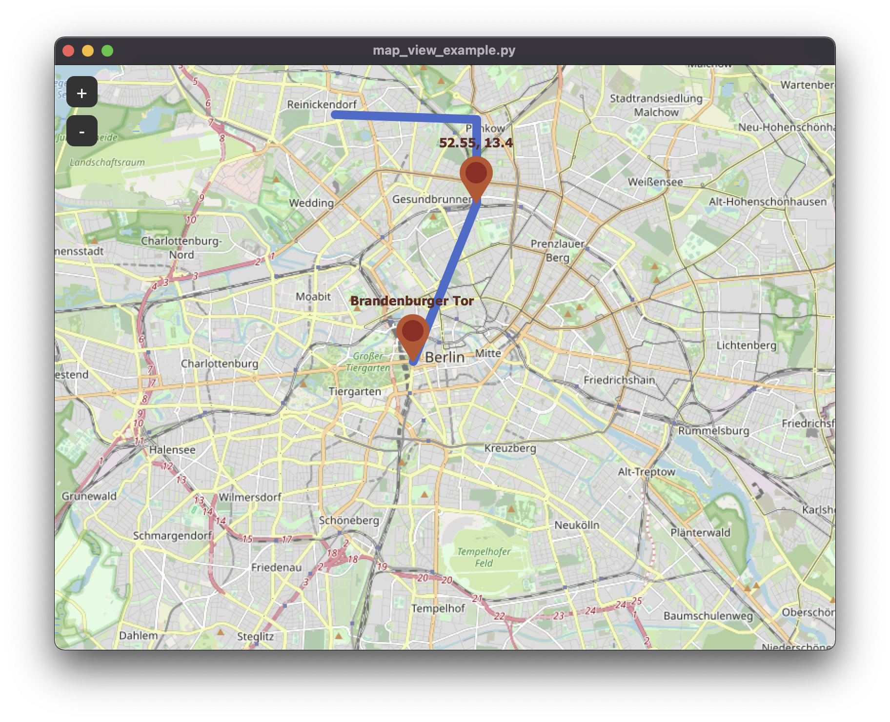
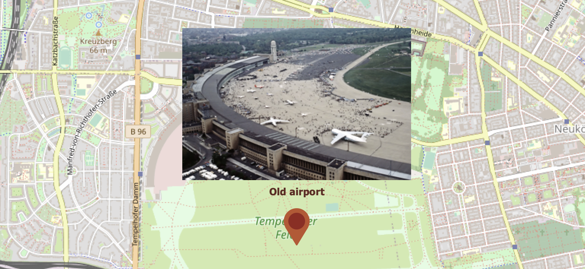
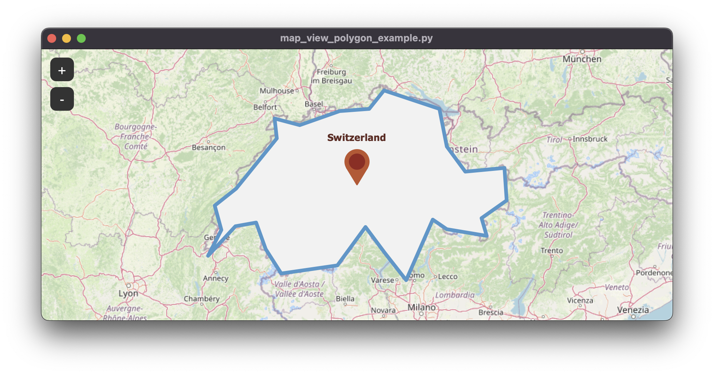
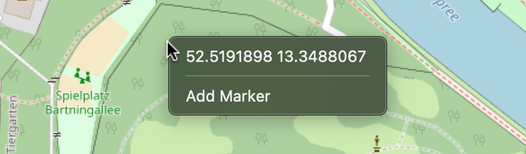

# TkinterMapView - simple Tkinter map component



TkinterMapView is a tile based interactive map renderer widget for the python Tkinter library.
By default, it displays the OpenStreetMap map, but you can change the tile server to
whatever you like, and it also supports a second tile server for overlays like OpenSeaMap.
You can set the current focus of the widget by a position or address, and place markers 
or a path on the map.

The above image program is produced by the code example `map_view_simple_example.py`.

But you can also embed the widget into a program like the following image shows.
For example by using the [CustomTkinter](https://github.com/TomSchimansky/CustomTkinter#readme) library,
which provides rounded buttons and frames in a light and dark mode:


| _`examples/map_with_customtkinter.py` on Windows 11_

# Installation

```
pip3 install tkintermapview
```
Update: ``pip3 install tkintermapview --upgrade``

https://pypi.org/project/tkintermapview/

# Documentation / Tutorial

- [Importing](#importing)
- [Create the widget](#create-the-widget)
- [Set coordinate position](#set-coordinate-position)
- [Set address position](#set-address-position)
- [Set position with marker](#set-position-with-marker)
- [Create position markers](#create-position-markers)
- [Create path from position list](#create-path-from-position-list)
- [Create polygon from position list](#create-polygon-from-position-list)
- [Mouse events on the map](#mouse-events-on-the-map)
- [Utility methods](#utility-methods)
- [Use other tile servers](#use-other-tile-servers)
- [Use offline tiles](#use-offline-tiles)

---
### Importing

Import tkinter as normal and from tkintermapview import the TkinterMapView widget.
```python
import tkinter
import tkintermapview
```
---
### Create the widget

Create the standard tkinter window and place a TkinterMapView in the middle of the window.
The first argument must be the widgets master, then you specify the `width`, `height` and `corner_radius`
of the widget.
```python
# create tkinter window
root_tk = tkinter.Tk()
root_tk.geometry(f"{800}x{600}")
root_tk.title("map_view_example.py")

# create map widget
map_widget = tkintermapview.TkinterMapView(root_tk, width=800, height=600, corner_radius=0)
map_widget.place(relx=0.5, rely=0.5, anchor=tkinter.CENTER)
```
If you also call `root_tk.mainloop()` at the end, this is already a fully working example to test the map widget.

---
### Set coordinate position

The standard position on which the map is focused is Berlin, Germany,
but you can change the position and zoom with the following commands.
The position must be given in decimal coordinates and the zoom ranges from
0 to 19 where 19 is the highest zoom level.
```python
# set current widget position and zoom
map_widget.set_position(48.860381, 2.338594)  # Paris, France
map_widget.set_zoom(15)
```
---
### Set address position

But you can not only set the position by decimal coordinates, but also by
an address string like ` "colosseo, rome, italy" ` or ` "3 St Margaret St, London, United Kingdom" `.
The address is converted to a position by the OpenStreetMap geocode service
Nomatim.
```python
# set current widget position by address
map_widget.set_address("colosseo, rome, italy")
```
---
### Set position with marker

If you also want a red marker at the set position with a text of the current location,
then you can pass the `marker=True` argument to the `set_position` or `set_address`
funtions. You get back a PositionMarker object, so that you can modify or delete the marker
later:
```python
# set current widget position by address
marker_1 = map_widget.set_address("colosseo, rome, italy", marker=True)

print(marker_1.position, marker_1.text)  # get position and text

marker_1.set_text("Colosseo in Rome")  # set new text
# marker_1.set_position(48.860381, 2.338594)  # change position
# marker_1.delete()
```
---
### Create position markers

You can also set a position marker without focusing the widget on it.
You can pass a ``text`` argument to the function and get back the marker
object, so that you can store the marker and modify or delete it later.
```python
# set a position marker
marker_2 = map_widget.set_marker(52.516268, 13.377695, text="Brandenburger Tor")
marker_3 = map_widget.set_marker(52.55, 13.4, text="52.55, 13.4")
# marker_3.set_position(...)
# marker_3.set_text(...)
# marker_3.delete()
```
A marker can be also customized by passing the following arguments to .set_marker(),
.set_address() or .set_position(): `text, font, image (PhotoImage), image_zoom_visibility,
marker_color_circle, marker_color_outside, text_color, command`.

The command function will be called when the marker is clicked and will
pass the clicked marker as an argument to the functin which gets called.

The given image will be visible above the marker when the zoom level is in the range specified
by `image_zoom_visibility`, which is tuple like the following (min_zoom, max_zoom).
`image_zoom_visibility=(0, float('inf'))` means the image will be visible alle the time.
The image can also be hidden by calling: `marker.hide_image(True)` or `marker.hide_image(False)`.
To check if the image is currently hidden you can access: `marker.image_hidden` which is True or False.

You can also store an object or some reference inside the marker with the ``data`` attribute, which
can be set when creating a marker, and accessed or modified with ``marker.data``. This data attribute
also exists for path and polygons.




---
### Create path from position list

You can also create a path which connects multiple markers or completely new positions.
You pass a list with position tuples to the function `set_path` and get back a path object.
The path object can be modified by adding a new position or remove a specific position.
````python
# set a path
path_1 = map_widget.set_path([marker_2.position, marker_3.position, (52.57, 13.4), (52.55, 13.35)])
# path_1.add_position(...)
# path_1.remove_position(...)
# path_1.delete()
````
---
### Create polygon from position list

To create a polygon on the map call the ``map_widget.set_polygon()`` function
and pass a list of coordinate tuples from which the polygon will be created.
You can edit the appearance with the following arguments: ``fill_color, outline_color, border_width``.
You can also set a command function which will be called when the polygon gets clicked and
which will get the polygon object as an argument.
````python
def polygon_click(polygon):
    print(f"polygon clicked - text: {polygon.name}")
    
polygon_1 = map_widget.set_polygon([(46.0732306, 6.0095215),
                                    ...
                                    (46.3772542, 6.4160156)],
                                   # fill_color=None,
                                   # outline_color="red",
                                   # border_width=12,
                                   command=polygon_click,
                                   name="switzerland_polygon")

# polygon_1.remove_position(46.3772542, 6.4160156)
# polygon_1.add_position(0, 0, index=5)
# polygon_1.delete()
````

In ``examples/map_view_polygon_example.py`` you can find the full example program,
which results in the following:


---
### Mouse events on the map

When you click on the map with the right mouse button, a menu pops up, where you can view the
current decimal coordinates and copy them into the clipboard by clicking them.
You can also add other options to this menu, with the ``map_widget.add_right_click_menu_command`` method:
```python
def add_marker_event(coords):
    print("Add marker:", coords)
    new_marker = map_widget.set_marker(coords[0], coords[1], text="new marker")
    

map_widget.add_right_click_menu_command(label="Add Marker",
                                        command=add_marker_event,
                                        pass_coords=True)
```
With the `label` argument you set the text inside the menu, and if `pass_coords`
is True, the clicked coordinates will be passed to the command function as a tuple. 



You can also assign a callback function for a left click event on the map with:
```python
def left_click_event(coordinates_tuple):
    print("Left click event with coordinates:", coordinates_tuple)
    
map_widget.add_left_click_map_command(left_click_event)
```
The callback function will get the decimal coordinates of the clicked location as a tuple.

---
### Utility methods

The following methods can be useful when working with coordinates and address strings,
they all use the geocoder library with the OSM provider: https://geocoder.readthedocs.io/providers/OpenStreetMap.html:

Convert decimal coords to address object:
```python
adr = tkintermapview.convert_coordinates_to_address(51.5122057, -0.0994014)
print(adr.street, adr.housenumber, adr.postal, adr.city, adr.state, adr.country, adr.latlng)
# Output: Knightrider Street None EC4 City of London England United Kingdom [51.512284050000005, -0.09981746110011651]
```
Convert decimal coords to city name:

```python
city = tkintermapview.convert_coordinates_to_city(51.5122057, -0.0994014)
# city: "City of London"
```

Convert decimal coords to country name:
```python
country = tkintermapview.convert_coordinates_to_city(51.5122057, -0.0994014)
# country: "United Kingdom"
```

Convert address string to decimal coords. If the address isn't found, the function returns None.

```python
address = tkintermapview.convert_address_to_coordinates("London")
# address: (51.5073219, -0.1276474)
```

---
### Use other tile servers

TkinterMapView uses OpenStreetMap tiles by default, but you can also change the
tile server to every url that includes ``{x} {y} {z}`` coordinates.
For example, you can use the standard Google Maps map style or Google Maps
satellite images:
````python
# example tile sever:
self.map_widget.set_tile_server("https://a.tile.openstreetmap.org/{z}/{x}/{y}.png")  # OpenStreetMap (default)
self.map_widget.set_tile_server("https://mt0.google.com/vt/lyrs=m&hl=en&x={x}&y={y}&z={z}&s=Ga", max_zoom=22)  # google normal
self.map_widget.set_tile_server("https://mt0.google.com/vt/lyrs=s&hl=en&x={x}&y={y}&z={z}&s=Ga", max_zoom=22)  # google satellite
self.map_widget.set_tile_server("http://c.tile.stamen.com/watercolor/{z}/{x}/{y}.png")  # painting style
self.map_widget.set_tile_server("http://a.tile.stamen.com/toner/{z}/{x}/{y}.png")  # black and white
self.map_widget.set_tile_server("https://tiles.wmflabs.org/hikebike/{z}/{x}/{y}.png")  # detailed hiking
self.map_widget.set_tile_server("https://tiles.wmflabs.org/osm-no-labels/{z}/{x}/{y}.png")  # no labels
self.map_widget.set_tile_server(""https://wmts.geo.admin.ch/1.0.0/ch.swisstopo.pixelkarte-farbe/default/current/3857/{z}/{x}/{y}.jpeg")  # swisstopo map

# example overlay tile server
self.map_widget.set_overlay_tile_server("http://tiles.openseamap.org/seamark//{z}/{x}/{y}.png")  # sea-map overlay
self.map_widget.set_overlay_tile_server("http://a.tiles.openrailwaymap.org/standard/{z}/{x}/{y}.png")  # railway infrastructure
````
---

### Use offline tiles

You can load tiles into a database to use them offline when there is no connection to 
the tile server. Check out [examples/load_offline_tiles.py](https://github.com/TomSchimansky/TkinterMapView/blob/main/examples/load_offline_tiles.py) for more information.

If you then create the TkinterMapView widget you pass the database path as an argument.
An example of this can be found here: [examples/map_with_offline_tiles.py](https://github.com/TomSchimansky/TkinterMapView/blob/main/examples/map_with%20offline_tiles.py)
You can also pass a max_zoom argument to limit the possible zoom range if the database just holds
the tiles until a specific zoom range which is not the limit of the used server.

---
